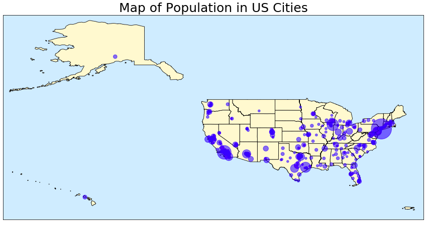
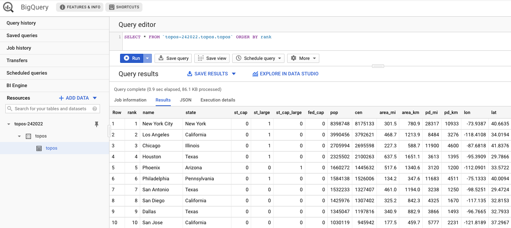

# Topos Data Engineer Intern Assignment

In this exercise I used Beautiful Soup to scrape statistics for all 314 incorporated places in the US with at least 100,000 residents as of 7/1/18. For each city, I collected the population estimates, time zone, official municipal website URL, and other data. 

To visualize the data, I also brought in a shapefile of US state boundaries available via US Census Tiger/Line. Here's a snapshot of the visualized data:

I also prepped the data to be loaded into BigQuery and loaded it once to make sure there were no hiccups:

